# 🌟 Domain Adaptation Methods: A Hierarchical Dual-Axis Taxonomy
*A curated, reproducible, and fully categorized collection of Domain Adaptation literature, organized under a novel two-axis classification scheme proposed in our review.*

---

## 🧭 Axis-1: Methodological Families (Our Proposed Taxonomy)

Unlike prior repositories that organize papers by *application* or *supervision regime*, this repository organizes **every method** under six **methodological families**, each refined into hierarchical **sub-branches** (our novel refinement of the literature):

```mermaid
graph TD
    A[Domain Adaptation Methods] --> B[1. Discrepancy-based]
    A --> C[2. Adversarial-based]
    A --> D[3. Multi-Domain based]
    A --> E[4. Ensemble-Based]
    A --> F[5. Teacher-Student based]
    A --> G[6. VLM / Foundation based]
    B --> B1[B1. Moment / Distance / OT Discrepancy]
    B --> B2[B2. Statistics & Normalization Alignment]
    B --> B3[B3. Clustering / Entropy / Structure Matching]
    B --> B4[B4. Prototype & Graph Alignment]
    C --> C1[C1. Adversarial Feature / Output Alignment]
    C --> C2[C2. GAN / Diffusion Pixel & Feature Synthesis]
    C --> C3[C3. Adversarial Output-Space & Entropy Minimization]
    D --> D1[D1. Multi-Source / Multi-Target]
    D --> D2[D2. Continual / Incremental / Federated]
    D --> D3[D3. Compound / Heterogeneous / Open-Set Shifts]
    E --> E1[E1. Co-Training & Committee Consistency]
    E --> E2[E2. Mixture-of-Experts & Knowledge Aggregation]
    F --> F1[F1. Mean-Teacher & Temporal Ensembling]
    F --> F2[F2. Self-Training & Pseudo-Labeling]
    F --> F3[F3. Knowledge Distillation]
    G --> G1[G1. Prompt / Adapter Tuning]
    G --> G2[G2. Vision-Language Distillation]
    G --> G3[G3. Zero-Shot VLM Adaptation]
```

## ⚖️ Axis-2: Operational Definitions & Classification Rules

Every paper is **additionally** tagged with one operational mechanism (column `Op.`), following the operational definitions and hierarchical decision rules of our review:

| Code | Operational Class | Definition |
|:---:|---|---|
| **FA** | Feature Alignment | Minimizes statistical discrepancy between source/target distributions **without** altering feature-space dimensionality or structure. |
| **FAR** | Feature Augmentation / Reconstruction | Explicitly **generates** synthetic feature variations, reconstructs masked/degraded features, or alters feature quantity/dimensionality (generative models, masking, disentanglement). |
| **FT** | Feature Transformation | Projects features into a **mathematically distinct space** via explicit linear (PCA, LDA) or non-linear (kernel, deep mapping) functions. |

**Hierarchical Decision Rules:**
1. **Rule 1 (Dimensionality/Generation Check):** generates/reconstructs features or alters dimensionality → **FAR**.
2. **Rule 2 (Space Mapping Check):** no generation, but core contribution is an explicit projection into a distinct space → **FT**.
3. **Rule 3 (Distribution Matching Check):** preserves feature-space structure while matching distributions → **FA**.
4. **Tie-Breaking Rule:** multi-mechanism papers are classified by their **primary objective / core claimed novelty**; secondary mechanisms are documented via the `Op.` column.

---

## 📗 Family 1 — Discrepancy-based
*Methods that explicitly minimize a statistical discrepancy (moments, OT distances, correlations, prototypes, graphs) between source and target distributions.*

| # | Paper Title | Year | Published In | GitHub | Op. |
|---|---|---|---|---|:---:|
| 1 | Domain Adaptive Object Detection via Dual-Stream Bilevel-Cycle Optimization | 2026 | arXiv | — | FAR |
| 2 | DATR: Unsupervised Domain Adaptive Detection Transformer With Dataset-Level Adaptation and Prototypical Alignment | 2025 | IEEE TIP | — | FA |
| 3 | Differential Alignment for Domain Adaptive Object Detection | 2025 | AAAI | — | FA |
| 4 | GDRIVE: Adaptive Object Detection in Autonomous Vehicles via Graph-Based Feature Learning | 2025 | ICASSP | — | FA |
| 5 | Enhancing Domain Adaptation for Plant Diseases Detection through Masked Image Consistency in Multi-Granularity Alignment | 2025 | Expert Systems with Applications | — | FAR |
| 6 | Enhancing Object Detection in Adverse Weather Conditions Through Entropy and Guided Multimodal Fusion | 2025 | ACCV | — | FA |
| 7 | Unsupervised Domain-Adaptive Object Detection via Localization Regression Alignment | 2024 | IEEE TNNLS | — | FA |
| 8 | JFDI: Joint Feature Differentiation and Interaction for Domain Adaptive Object Detection | 2024 | Neural Networks | — | FA |
| 9 | A Locally Weighted, Correlated Subdomain Adaptive Network for Transfer Learning | 2024 | Image and Vision Computing | — | FA |
| 10 | Robust Domain Adaptive Object Detection With Unified Multi-Granularity Alignment | 2024 | IEEE TPAMI | — | FA |
| 11 | Diverse Feature-Level Guidance Adjustments for Unsupervised Domain Adaptative Object Detection | 2024 | Applied Sciences | — | FA |
| 12 | Domain Adaptation based Object Detection for Autonomous Driving in Foggy and Rainy Weather | 2024 | IEEE TIV | — | FA |
| 13 | Advancing Industrial Object Detection Through Domain Adaptation: A Solution for Industry 5.0 | 2024 | Actuators | — | FA |
| 14 | A Step-Wise Domain Adaptation Detection Transformer for Object Detection under Poor Visibility Conditions | 2024 | Remote Sensing | — | FA |
| 15 | DA-DETR: Domain Adaptive Detection Transformer with Information Fusion | 2023 | CVPR | — | FA |
| 16 | CAST-YOLO: An Improved YOLO Based on a Cross-Attention Strategy Transformer for Foggy Weather Adaptive Detection | 2023 | Applied Sciences | — | FA |
| 17 | Decompose to Adapt: Cross-Domain Object Detection Via Feature Disentanglement | 2023 | IEEE TMM | — | FAR |
| 18 | YOLO-G: Improved YOLO for Cross-Domain Object Detection | 2023 | PLOS ONE | — | FA |
| 19 | An Object Detection Method Based on Feature Uncertainty Domain Adaptation for Autonomous Driving | 2023 | Applied Sciences | — | FA |
| 20 | Class Probability Matching Using Kernel Methods for Label Shift Adaptation | 2023 | arXiv | — | FA |
| 21 | Global-Local Regularization Via Distributional Robustness (GLOT) | 2023 | AISTATS | [Code](https://github.com/VietHoang1512/GLOT/) | FA |
| 22 | Exploring Sequence Feature Alignment for Domain Adaptive Detection Transformers | 2022 | arXiv | — | FA |
| 23 | Uncertainty-Aware Unsupervised Domain Adaptation in Object Detection | 2022 | IEEE TMM | — | FA |
| 24 | C2FDA: Coarse-to-Fine Domain Adaptation for Traffic Object Detection | 2022 | IEEE TITS | — | FA |
| 25 | RFA-Net: Reconstructed Feature Alignment Network for Domain Adaptation Object Detection in Remote Sensing | 2022 | IEEE JSTARS | — | FAR |
| 26 | Task-specific Inconsistency Alignment for Domain Adaptive Object Detection (TIA) | 2022 | CVPR | [Code](https://github.com/MCG-NJU/TIA) | FA |
| 27 | Decoupled Adaptation for Cross-Domain Object Detection (D-adapt) | 2022 | ICLR | [Code](https://github.com/thuml/Decoupled-Adaptation-for-Cross-Domain-Object-Detection) | FA |
| 28 | SCAN: Cross Domain Object Detection with Semantic Conditioned Adaptation | 2022 | AAAI | [Code](https://github.com/CityU-AIM-Group/SCAN) | FA |
| 29 | SIGMA: Semantic-complete Graph Matching for Domain Adaptive Object Detection | 2022 | CVPR | [Code](https://github.com/CityU-AIM-Group/SIGMA) | FA |
| 30 | H²FA R-CNN: Holistic and Hierarchical Feature Alignment for Cross-Domain Weakly Supervised Object Detection | 2022 | CVPR | [Code](https://github.com/XuYunqiu/H2FA_R-CNN) | FA |
| 31 | Domain Adaptation Based on Multi-Kernel Learning | 2022 | ACAI | — | FT |
| 32 | RPN Prototype Alignment for Domain Adaptive Object Detector | 2021 | CVPR | — | FA |
| 33 | Dual Bipartite Graph Learning: A General Approach for Domain Adaptive Object Detection | 2021 | ICCV | — | FA |
| 34 | Seeking Similarities over Differences: Similarity-based Domain Alignment for Adaptive Object Detection | 2021 | ICCV | — | FA |
| 35 | Domain-Specific Suppression for Adaptive Object Detection | 2021 | CVPR | — | FA |
| 36 | I3Net: Implicit Instance-Invariant Network for Adapting One-Stage Object Detectors | 2021 | CVPR | — | FA |
| 37 | MeGA-CDA: Memory Guided Attention for Category-Aware Unsupervised Domain Adaptive Object Detection | 2021 | CVPR | — | FA |
| 38 | Informative and Consistent Correspondence Mining for Cross-Domain Weakly Supervised Object Detection | 2021 | CVPR | — | FA |
| 39 | FixBi: Bridging Domain Spaces for Unsupervised Domain Adaptation | 2021 | CVPR | — | FAR |
| 40 | Reducing the Covariate Shift by Mirror Samples in Cross Domain Alignment | 2021 | NeurIPS | — | FAR |
| 41 | Transferable Semantic Augmentation for Domain Adaptation (TSA) | 2021 | CVPR | [Code](https://github.com/BIT-DA/TSA) | FAR |
| 42 | Semantic Concentration for Domain Adaptation | 2021 | ICCV | — | FA |
| 43 | Conditional Bures Metric for Domain Adaptation | 2021 | CVPR | — | FA |
| 44 | Exploring Categorical Regularization for Domain Adaptive Object Detection | 2020 | CVPR | [Code](https://github.com/Megvii-Nanjing/CR-DA-DET) | FA |
| 45 | Collaborative Training Between Region Proposal Localization and Classification for Domain Adaptive Object Detection | 2020 | ECCV | — | FA |
| 46 | Cross-domain Object Detection through Coarse-to-Fine Feature Adaptation | 2020 | CVPR | — | FA |
| 47 | Harmonizing Transferability and Discriminability for Adapting Object Detectors (HTCN) | 2020 | CVPR | [Code](https://github.com/chaoqichen/HTCN) | FA |
| 48 | Cross-domain Detection via Graph-induced Prototype Alignment (GPA) | 2020 | CVPR | [Code](https://github.com/ChrisAllenMing/GPA-detection) | FA |
| 49 | Every Pixel Matters: Center-aware Feature Alignment for Domain Adaptive Object Detector | 2020 | ECCV | — | FA |
| 50 | Adapting Object Detectors with Conditional Domain Normalization | 2020 | ECCV | — | FA |
| 51 | Prior-based Domain Adaptive Object Detection for Hazy and Rainy Conditions | 2020 | ECCV | — | FA |
| 52 | SSA-DA: Bi-dimensional Feature Alignment for Cross-Domain Object Detection | 2020 | ECCV Workshop | — | FA |
| 53 | MCAR: Adaptive Object Detection with Dual Multi-label Prediction | 2020 | ECCV | — | FA |
| 54 | Enhanced Transport Distance for Unsupervised Domain Adaptation (ETD) | 2020 | CVPR | [Code](https://github.com/yimzhai3/ETD) | FA |
| 55 | Reliable Weighted Optimal Transport for Unsupervised Domain Adaptation (RWOT) | 2020 | CVPR | — | FA |
| 56 | HoMM: Higher-order Moment Matching for Unsupervised Domain Adaptation | 2020 | AAAI | [Code](https://github.com/chenchao666/HoMM-Master) | FA |
| 57 | Unsupervised Domain Adaptation via Structurally Regularized Deep Clustering (SRDC) | 2020 | CVPR | [Code](https://github.com/huitangtang/SRDC-CVPR2020) | FA |
| 58 | Towards Discriminability and Diversity: Batch Nuclear-norm Maximization (BNM) | 2020 | CVPR | [Code](https://github.com/cuishuhao/BNM) | FA |
| 59 | Spherical Space Domain Adaptation With Robust Pseudo-Label Loss (RSDA) | 2020 | CVPR | [Code](https://github.com/XJTU-XGU/RSDA) | FA |
| 60 | Minimum Class Confusion for Versatile Domain Adaptation (MCC) | 2020 | ECCV | — | FA |
| 61 | Adapting Object Detectors via Selective Cross-Domain Alignment (SCDA) | 2019 | CVPR | [Code](https://github.com/xinge008/SCDA) | FA |
| 62 | Simplified Neural Unsupervised Domain Adaptation | 2019 | NAACL | — | FA |
| 63 | Strong-Weak Distribution Alignment for Adaptive Object Detection | 2019 | CVPR | [Code](https://github.com/VisionLearningGroup/DA_Detection) | FA |
| 64 | SCL: Gradient Detach Based Stacked Complementary Losses for Domain Adaptive Object Detection | 2019 | arXiv | — | FA |
| 65 | Robust Unsupervised Domain Adaptation for Neural Networks via Moment Alignment | 2019 | Information Sciences | — | FA |
| 66 | Transferable Representation Learning with Deep Adaptation Networks | 2019 | IEEE TPAMI | — | FA |
| 67 | Domain Specific Batch Normalization for Unsupervised Domain Adaptation (DSBN) | 2019 | CVPR | [Code](https://github.com/wgchang/DSBN) | FA |
| 68 | Switchable Whitening for Deep Representation Learning | 2019 | ICCV | [Code](https://github.com/XingangPan/Switchable-Whitening) | FT |
| 69 | Unsupervised Domain Adaptation using Feature-Whitening and Consensus Loss (DWT) | 2019 | CVPR | [Code](https://github.com/roysubhankar/dwt-domain-adaptation) | FT |
| 70 | Larger Norm More Transferable: An Adaptive Feature Norm Approach (AFN) | 2019 | ICCV | [Code](https://github.com/jihanyang/AFN) | FA |
| 71 | Transferrable Prototypical Networks for Unsupervised Domain Adaptation | 2019 | CVPR | — | FA |
| 72 | Contrastive Adaptation Network for Unsupervised Domain Adaptation (CLAN) | 2019 | CVPR | [Code](https://github.com/kgl-prml/Contrastive-Adaptation-Network-for-Unsupervised-Domain-Adaptation) | FA |
| 73 | Virtual Mixup Training for Unsupervised Domain Adaptation (VMT) | 2019 | arXiv | [Code](https://github.com/xudonmao/VMT) | FAR |
| 74 | Minimal-Entropy Correlation Alignment for Unsupervised Deep Domain Adaptation | 2018 | ICLR | [Code](https://github.com/pmorerio/minimal-entropy-correlation-alignment) | FA |
| 75 | DeepJDOT: Deep Joint Distribution Optimal Transport for Unsupervised Domain Adaptation | 2018 | ECCV | [Code](https://github.com/bbdamodaran/deepJDOT) | FA |
| 76 | Deep Reconstruction-Classification Networks for Unsupervised Domain Adaptation (DRCN) | 2016 | ECCV | — | FAR |
| 77 | Aligning Infinite-Dimensional Covariance Matrices in Reproducing Kernel Hilbert Spaces | 2018 | CVPR | — | FT |
| 78 | Adaptive Batch Normalization for Practical Domain Adaptation | 2018 | Pattern Recognition | — | FA |
| 79 | Unsupervised Domain Adaptation by Mapped Correlation Alignment | 2018 | IEEE Access | — | FA |
| 80 | Deep Transfer Learning with Joint Adaptation Networks (JAN) | 2017 | ICML | [Code](https://github.com/thuml/Xlearn) | FA |
| 81 | Central Moment Discrepancy for Unsupervised Domain Adaptation (CMD) | 2017 | ICLR | [Code](https://github.com/wzell/cmd) | FA |
| 82 | Joint Distribution Optimal Transportation for Domain Adaptation (JDOT) | 2017 | NeurIPS | [Code](https://github.com/rflamary/JDOT) | FA |
| 83 | AutoDIAL: Automatic DomaIn Alignment Layers | 2017 | ICCV | — | FT |
| 84 | Unsupervised Domain Adaptation with Residual Transfer Networks (RTN) | 2016 | NeurIPS | [Code](https://github.com/thuml/Xlearn) | FA |
| 85 | Deep CORAL: Correlation Alignment for Deep Domain Adaptation | 2016 | ECCV | — | FA |
| 86 | Learning Transferable Features with Deep Adaptation Networks (DAN) | 2015 | ICML | [Code](https://github.com/thuml/DAN) | FA |
| 87 | Deep Domain Confusion: Maximizing for Domain Invariance | 2014 | arXiv | — | FA |
| 88 | What You Saw Is Not What You Get: Domain Adaptation Using Asymmetric Kernel Transforms | 2011 | CVPR | — | FT |
| 89 | A Kernel Method for the Two-Sample-Problem (MMD) | 2007 | NeurIPS | — | FA |
| 90 | Feature-Level Domain Adaptation | n.d. | Preprint | — | FA |
