# 🌟 Domain Adaptation Methods: A Hierarchical Dual-Axis Taxonomy
*A curated, reproducible, and fully categorized collection of Domain Adaptation literature, organized under a novel two-axis classification scheme proposed in our review.*

---

## 🧭 Axis-1: Methodological Families (Our Proposed Taxonomy)

Unlike prior repositories that organize papers by *application* or *supervision regime*, this repository organizes **every method** under six **methodological families**, each refined into hierarchical **sub-branches** (our novel refinement of the literature):

```mermaid
graph TD
    A[Domain Adaptation Methods] --> B[1. Discrepancy-based]
    A --> C[2. Adversarial-based]
    A --> D[3. Multi-Domain based]
    A --> E[4. Ensemble-Based]
    A --> F[5. Teacher-Student based]
    A --> G[6. VLM / Foundation based]
    B --> B1[B1. Moment / Distance / OT Discrepancy]
    B --> B2[B2. Statistics & Normalization Alignment]
    B --> B3[B3. Clustering / Entropy / Structure Matching]
    B --> B4[B4. Prototype & Graph Alignment]
    C --> C1[C1. Adversarial Feature / Output Alignment]
    C --> C2[C2. GAN / Diffusion Pixel & Feature Synthesis]
    C --> C3[C3. Adversarial Output-Space & Entropy Minimization]
    D --> D1[D1. Multi-Source / Multi-Target]
    D --> D2[D2. Continual / Incremental / Federated]
    D --> D3[D3. Compound / Heterogeneous / Open-Set Shifts]
    E --> E1[E1. Co-Training & Committee Consistency]
    E --> E2[E2. Mixture-of-Experts & Knowledge Aggregation]
    F --> F1[F1. Mean-Teacher & Temporal Ensembling]
    F --> F2[F2. Self-Training & Pseudo-Labeling]
    F --> F3[F3. Knowledge Distillation]
    G --> G1[G1. Prompt / Adapter Tuning]
    G --> G2[G2. Vision-Language Distillation]
    G --> G3[G3. Zero-Shot VLM Adaptation]
```

## ⚖️ Axis-2: Operational Definitions & Classification Rules

Every paper is **additionally** tagged with one operational mechanism (column `Op.`), following the operational definitions and hierarchical decision rules of our review:

| Code | Operational Class | Definition |
|:---:|---|---|
| **FA** | Feature Alignment | Minimizes statistical discrepancy between source/target distributions **without** altering feature-space dimensionality or structure. |
| **FAR** | Feature Augmentation / Reconstruction | Explicitly **generates** synthetic feature variations, reconstructs masked/degraded features, or alters feature quantity/dimensionality (generative models, masking, disentanglement). |
| **FT** | Feature Transformation | Projects features into a **mathematically distinct space** via explicit linear (PCA, LDA) or non-linear (kernel, deep mapping) functions. |

**Hierarchical Decision Rules:**
1. **Rule 1 (Dimensionality/Generation Check):** generates/reconstructs features or alters dimensionality → **FAR**.
2. **Rule 2 (Space Mapping Check):** no generation, but core contribution is an explicit projection into a distinct space → **FT**.
3. **Rule 3 (Distribution Matching Check):** preserves feature-space structure while matching distributions → **FA**.
4. **Tie-Breaking Rule:** multi-mechanism papers are classified by their **primary objective / core claimed novelty**; secondary mechanisms are documented via the `Op.` column.

---

## 📗 Family 1 — Discrepancy-based
*Methods that explicitly minimize a statistical discrepancy (moments, OT distances, correlations, prototypes, graphs) between source and target distributions.*

| # | Paper Title | Year | Published In | GitHub | Op. |
|---|---|---|---|---|:---:|
| 1 | Domain Adaptive Object Detection via Dual-Stream Bilevel-Cycle Optimization | 2026 | arXiv | — | FAR |
| 2 | DATR: Unsupervised Domain Adaptive Detection Transformer With Dataset-Level Adaptation and Prototypical Alignment | 2025 | IEEE TIP | — | FA |
| 3 | Differential Alignment for Domain Adaptive Object Detection | 2025 | AAAI | — | FA |
| 4 | GDRIVE: Adaptive Object Detection in Autonomous Vehicles via Graph-Based Feature Learning | 2025 | ICASSP | — | FA |
| 5 | Enhancing Domain Adaptation for Plant Diseases Detection through Masked Image Consistency in Multi-Granularity Alignment | 2025 | Expert Systems with Applications | — | FAR |
| 6 | Enhancing Object Detection in Adverse Weather Conditions Through Entropy and Guided Multimodal Fusion | 2025 | ACCV | — | FA |
| 7 | Unsupervised Domain-Adaptive Object Detection via Localization Regression Alignment | 2024 | IEEE TNNLS | — | FA |
| 8 | JFDI: Joint Feature Differentiation and Interaction for Domain Adaptive Object Detection | 2024 | Neural Networks | — | FA |
| 9 | A Locally Weighted, Correlated Subdomain Adaptive Network for Transfer Learning | 2024 | Image and Vision Computing | — | FA |
| 10 | Robust Domain Adaptive Object Detection With Unified Multi-Granularity Alignment | 2024 | IEEE TPAMI | — | FA |
| 11 | Diverse Feature-Level Guidance Adjustments for Unsupervised Domain Adaptative Object Detection | 2024 | Applied Sciences | — | FA |
| 12 | Domain Adaptation based Object Detection for Autonomous Driving in Foggy and Rainy Weather | 2024 | IEEE TIV | — | FA |
| 13 | Advancing Industrial Object Detection Through Domain Adaptation: A Solution for Industry 5.0 | 2024 | Actuators | — | FA |
| 14 | A Step-Wise Domain Adaptation Detection Transformer for Object Detection under Poor Visibility Conditions | 2024 | Remote Sensing | — | FA |
| 15 | DA-DETR: Domain Adaptive Detection Transformer with Information Fusion | 2023 | CVPR | — | FA |
| 16 | CAST-YOLO: An Improved YOLO Based on a Cross-Attention Strategy Transformer for Foggy Weather Adaptive Detection | 2023 | Applied Sciences | — | FA |
| 17 | Decompose to Adapt: Cross-Domain Object Detection Via Feature Disentanglement | 2023 | IEEE TMM | — | FAR |
| 18 | YOLO-G: Improved YOLO for Cross-Domain Object Detection | 2023 | PLOS ONE | — | FA |
| 19 | An Object Detection Method Based on Feature Uncertainty Domain Adaptation for Autonomous Driving | 2023 | Applied Sciences | — | FA |
| 20 | Class Probability Matching Using Kernel Methods for Label Shift Adaptation | 2023 | arXiv | — | FA |
| 21 | Global-Local Regularization Via Distributional Robustness (GLOT) | 2023 | AISTATS | [Code](https://github.com/VietHoang1512/GLOT/) | FA |
| 22 | Exploring Sequence Feature Alignment for Domain Adaptive Detection Transformers | 2022 | arXiv | — | FA |
| 23 | Uncertainty-Aware Unsupervised Domain Adaptation in Object Detection | 2022 | IEEE TMM | — | FA |
| 24 | C2FDA: Coarse-to-Fine Domain Adaptation for Traffic Object Detection | 2022 | IEEE TITS | — | FA |
| 25 | RFA-Net: Reconstructed Feature Alignment Network for Domain Adaptation Object Detection in Remote Sensing | 2022 | IEEE JSTARS | — | FAR |
| 26 | Task-specific Inconsistency Alignment for Domain Adaptive Object Detection (TIA) | 2022 | CVPR | [Code](https://github.com/MCG-NJU/TIA) | FA |
| 27 | Decoupled Adaptation for Cross-Domain Object Detection (D-adapt) | 2022 | ICLR | [Code](https://github.com/thuml/Decoupled-Adaptation-for-Cross-Domain-Object-Detection) | FA |
| 28 | SCAN: Cross Domain Object Detection with Semantic Conditioned Adaptation | 2022 | AAAI | [Code](https://github.com/CityU-AIM-Group/SCAN) | FA |
| 29 | SIGMA: Semantic-complete Graph Matching for Domain Adaptive Object Detection | 2022 | CVPR | [Code](https://github.com/CityU-AIM-Group/SIGMA) | FA |
| 30 | H²FA R-CNN: Holistic and Hierarchical Feature Alignment for Cross-Domain Weakly Supervised Object Detection | 2022 | CVPR | [Code](https://github.com/XuYunqiu/H2FA_R-CNN) | FA |
| 31 | Domain Adaptation Based on Multi-Kernel Learning | 2022 | ACAI | — | FT |
| 32 | RPN Prototype Alignment for Domain Adaptive Object Detector | 2021 | CVPR | — | FA |
| 33 | Dual Bipartite Graph Learning: A General Approach for Domain Adaptive Object Detection | 2021 | ICCV | — | FA |
| 34 | Seeking Similarities over Differences: Similarity-based Domain Alignment for Adaptive Object Detection | 2021 | ICCV | — | FA |
| 35 | Domain-Specific Suppression for Adaptive Object Detection | 2021 | CVPR | — | FA |
| 36 | I3Net: Implicit Instance-Invariant Network for Adapting One-Stage Object Detectors | 2021 | CVPR | — | FA |
| 37 | MeGA-CDA: Memory Guided Attention for Category-Aware Unsupervised Domain Adaptive Object Detection | 2021 | CVPR | — | FA |
| 38 | Informative and Consistent Correspondence Mining for Cross-Domain Weakly Supervised Object Detection | 2021 | CVPR | — | FA |
| 39 | FixBi: Bridging Domain Spaces for Unsupervised Domain Adaptation | 2021 | CVPR | — | FAR |
| 40 | Reducing the Covariate Shift by Mirror Samples in Cross Domain Alignment | 2021 | NeurIPS | — | FAR |
| 41 | Transferable Semantic Augmentation for Domain Adaptation (TSA) | 2021 | CVPR | [Code](https://github.com/BIT-DA/TSA) | FAR |
| 42 | Semantic Concentration for Domain Adaptation | 2021 | ICCV | — | FA |
| 43 | Conditional Bures Metric for Domain Adaptation | 2021 | CVPR | — | FA |
| 44 | Exploring Categorical Regularization for Domain Adaptive Object Detection | 2020 | CVPR | [Code](https://github.com/Megvii-Nanjing/CR-DA-DET) | FA |
| 45 | Collaborative Training Between Region Proposal Localization and Classification for Domain Adaptive Object Detection | 2020 | ECCV | — | FA |
| 46 | Cross-domain Object Detection through Coarse-to-Fine Feature Adaptation | 2020 | CVPR | — | FA |
| 47 | Harmonizing Transferability and Discriminability for Adapting Object Detectors (HTCN) | 2020 | CVPR | [Code](https://github.com/chaoqichen/HTCN) | FA |
| 48 | Cross-domain Detection via Graph-induced Prototype Alignment (GPA) | 2020 | CVPR | [Code](https://github.com/ChrisAllenMing/GPA-detection) | FA |
| 49 | Every Pixel Matters: Center-aware Feature Alignment for Domain Adaptive Object Detector | 2020 | ECCV | — | FA |
| 50 | Adapting Object Detectors with Conditional Domain Normalization | 2020 | ECCV | — | FA |
| 51 | Prior-based Domain Adaptive Object Detection for Hazy and Rainy Conditions | 2020 | ECCV | — | FA |
| 52 | SSA-DA: Bi-dimensional Feature Alignment for Cross-Domain Object Detection | 2020 | ECCV Workshop | — | FA |
| 53 | MCAR: Adaptive Object Detection with Dual Multi-label Prediction | 2020 | ECCV | — | FA |
| 54 | Enhanced Transport Distance for Unsupervised Domain Adaptation (ETD) | 2020 | CVPR | [Code](https://github.com/yimzhai3/ETD) | FA |
| 55 | Reliable Weighted Optimal Transport for Unsupervised Domain Adaptation (RWOT) | 2020 | CVPR | — | FA |
| 56 | HoMM: Higher-order Moment Matching for Unsupervised Domain Adaptation | 2020 | AAAI | [Code](https://github.com/chenchao666/HoMM-Master) | FA |
| 57 | Unsupervised Domain Adaptation via Structurally Regularized Deep Clustering (SRDC) | 2020 | CVPR | [Code](https://github.com/huitangtang/SRDC-CVPR2020) | FA |
| 58 | Towards Discriminability and Diversity: Batch Nuclear-norm Maximization (BNM) | 2020 | CVPR | [Code](https://github.com/cuishuhao/BNM) | FA |
| 59 | Spherical Space Domain Adaptation With Robust Pseudo-Label Loss (RSDA) | 2020 | CVPR | [Code](https://github.com/XJTU-XGU/RSDA) | FA |
| 60 | Minimum Class Confusion for Versatile Domain Adaptation (MCC) | 2020 | ECCV | — | FA |
| 61 | Adapting Object Detectors via Selective Cross-Domain Alignment (SCDA) | 2019 | CVPR | [Code](https://github.com/xinge008/SCDA) | FA |
| 62 | Simplified Neural Unsupervised Domain Adaptation | 2019 | NAACL | — | FA |
| 63 | Strong-Weak Distribution Alignment for Adaptive Object Detection | 2019 | CVPR | [Code](https://github.com/VisionLearningGroup/DA_Detection) | FA |
| 64 | SCL: Gradient Detach Based Stacked Complementary Losses for Domain Adaptive Object Detection | 2019 | arXiv | — | FA |
| 65 | Robust Unsupervised Domain Adaptation for Neural Networks via Moment Alignment | 2019 | Information Sciences | — | FA |
| 66 | Transferable Representation Learning with Deep Adaptation Networks | 2019 | IEEE TPAMI | — | FA |
| 67 | Domain Specific Batch Normalization for Unsupervised Domain Adaptation (DSBN) | 2019 | CVPR | [Code](https://github.com/wgchang/DSBN) | FA |
| 68 | Switchable Whitening for Deep Representation Learning | 2019 | ICCV | [Code](https://github.com/XingangPan/Switchable-Whitening) | FT |
| 69 | Unsupervised Domain Adaptation using Feature-Whitening and Consensus Loss (DWT) | 2019 | CVPR | [Code](https://github.com/roysubhankar/dwt-domain-adaptation) | FT |
| 70 | Larger Norm More Transferable: An Adaptive Feature Norm Approach (AFN) | 2019 | ICCV | [Code](https://github.com/jihanyang/AFN) | FA |
| 71 | Transferrable Prototypical Networks for Unsupervised Domain Adaptation | 2019 | CVPR | — | FA |
| 72 | Contrastive Adaptation Network for Unsupervised Domain Adaptation (CLAN) | 2019 | CVPR | [Code](https://github.com/kgl-prml/Contrastive-Adaptation-Network-for-Unsupervised-Domain-Adaptation) | FA |
| 73 | Virtual Mixup Training for Unsupervised Domain Adaptation (VMT) | 2019 | arXiv | [Code](https://github.com/xudonmao/VMT) | FAR |
| 74 | Minimal-Entropy Correlation Alignment for Unsupervised Deep Domain Adaptation | 2018 | ICLR | [Code](https://github.com/pmorerio/minimal-entropy-correlation-alignment) | FA |
| 75 | DeepJDOT: Deep Joint Distribution Optimal Transport for Unsupervised Domain Adaptation | 2018 | ECCV | [Code](https://github.com/bbdamodaran/deepJDOT) | FA |
| 76 | Deep Reconstruction-Classification Networks for Unsupervised Domain Adaptation (DRCN) | 2016 | ECCV | — | FAR |
| 77 | Aligning Infinite-Dimensional Covariance Matrices in Reproducing Kernel Hilbert Spaces | 2018 | CVPR | — | FT |
| 78 | Adaptive Batch Normalization for Practical Domain Adaptation | 2018 | Pattern Recognition | — | FA |
| 79 | Unsupervised Domain Adaptation by Mapped Correlation Alignment | 2018 | IEEE Access | — | FA |
| 80 | Deep Transfer Learning with Joint Adaptation Networks (JAN) | 2017 | ICML | [Code](https://github.com/thuml/Xlearn) | FA |
| 81 | Central Moment Discrepancy for Unsupervised Domain Adaptation (CMD) | 2017 | ICLR | [Code](https://github.com/wzell/cmd) | FA |
| 82 | Joint Distribution Optimal Transportation for Domain Adaptation (JDOT) | 2017 | NeurIPS | [Code](https://github.com/rflamary/JDOT) | FA |
| 83 | AutoDIAL: Automatic DomaIn Alignment Layers | 2017 | ICCV | — | FT |
| 84 | Unsupervised Domain Adaptation with Residual Transfer Networks (RTN) | 2016 | NeurIPS | [Code](https://github.com/thuml/Xlearn) | FA |
| 85 | Deep CORAL: Correlation Alignment for Deep Domain Adaptation | 2016 | ECCV | — | FA |
| 86 | Learning Transferable Features with Deep Adaptation Networks (DAN) | 2015 | ICML | [Code](https://github.com/thuml/DAN) | FA |
| 87 | Deep Domain Confusion: Maximizing for Domain Invariance | 2014 | arXiv | — | FA |
| 88 | What You Saw Is Not What You Get: Domain Adaptation Using Asymmetric Kernel Transforms | 2011 | CVPR | — | FT |
| 89 | A Kernel Method for the Two-Sample-Problem (MMD) | 2007 | NeurIPS | — | FA |
| 90 | Feature-Level Domain Adaptation | n.d. | Preprint | — | FA |

## 📕 Family 2 — Adversarial-based
*Methods whose core mechanism relies on adversarial games (domain discriminators, classifier discrepancy, adversarial entropy/output-space minimization) or adversarial/generative synthesis (GANs, diffusion, image-to-image translation).*

| # | Paper Title | Year | Published In | GitHub | Op. |
|---|---|---|---|---|:---:|
| 1 | RT-DATR: Real-time Unsupervised Domain Adaptive Detection Transformer with Adversarial Feature Learning | 2025 | arXiv | — | FA |
| 2 | CMDA: Cross-Modal and Domain Adversarial Adaptation for LiDAR-Based 3D Object Detection | 2024 | AAAI | — | FA |
| 3 | SPA: A Graph Spectral Alignment Perspective for Domain Adaptation | 2023 | NeurIPS | [Code](https://github.com/CrownX/SPA) | FA |
| 4 | Disentangled Discriminator for Unsupervised Domain Adaptation on Object Detection | 2023 | IROS | — | FAR |
| 5 | Deliberated Domain Bridging for Domain Adaptive Semantic Segmentation | 2022 | NeurIPS | [Code](https://github.com/xiaoachen98/DDB) | FAR |
| 6 | Reusing the Task-specific Classifier as a Discriminator (DALN) | 2022 | CVPR | [Code](https://github.com/xiaoachen98/DALN) | FA |
| 7 | A Closer Look at Smoothness in Domain Adversarial Training (SDAT) | 2022 | ICML | [Code](https://github.com/val-iisc/SDAT) | FA |
| 8 | ToAlign: Task-oriented Alignment for Unsupervised Domain Adaptation | 2021 | NeurIPS | [Code](https://github.com/microsoft/UDA) | FA |
| 9 | Adversarial UDA With Conditional and Label Shift: Infer, Align and Iterate | 2021 | ICCV | — | FA |
| 10 | Gradient Distribution Alignment Certificates Better Adversarial Domain Adaptation | 2021 | ICCV | — | FA |
| 11 | Re-energizing Domain Discriminator with Sample Relabeling for Adversarial DA | 2021 | ICCV | — | FA |
| 12 | Cross-Domain Gradient Discrepancy Minimization (CGDM) | 2021 | CVPR | [Code](https://github.com/lijin118/CGDM) | FA |
| 13 | MetaAlign: Coordinating Domain Alignment and Classification | 2021 | CVPR | [Code](https://github.com/microsoft/UDA) | FA |
| 14 | Multi-Target Adversarial Frameworks for Domain Adaptation in Semantic Segmentation | 2021 | ICCV | — | FA |
| 15 | Partial Video Domain Adaptation With Partial Adversarial Temporal Attentive Network (PATAN) | 2021 | ICCV | [Code](https://github.com/xuyu0010/PATAN) | FA |
| 16 | RDA: Robust Domain Adaptation via Fourier Adversarial Attacking | 2021 | ICCV | — | FAR |
| 17 | Self-adaptive Re-weighted Adversarial Domain Adaptation (SrADA) | 2020 | IJCAI | — | FA |
| 18 | DIRL: Domain-Invariant Representation Learning for Sim-to-Real Transfer | 2020 | CoRL | [Project](https://www.sites.google.com/view/dirl) | FA |
| 19 | Classes Matter: A Fine-grained Adversarial Approach to Cross-domain Semantic Segmentation (FADA) | 2020 | ECCV | [Code](https://github.com/JDAI-CV/FADA) | FA |
| 20 | Gradually Vanishing Bridge for Adversarial Domain Adaptation (GVB) | 2020 | CVPR | [Code](https://github.com/cuishuhao/GVB) | FA |
| 21 | Implicit Class-Conditioned Domain Alignment for UDA | 2020 | ICML | [Code](https://github.com/xiangdal/implicit_alignment) | FA |
| 22 | Adversarial-Learned Loss for Domain Adaptation | 2020 | AAAI | — | FA |
| 23 | Structure-Aware Feature Fusion for Unsupervised Domain Adaptation | 2020 | AAAI | — | FA |
| 24 | Adversarial Domain Adaptation with Domain Mixup | 2020 | AAAI | [Code](https://github.com/ChrisAllenMing/Mixup_for_UDA) | FAR |
| 25 | Discriminative Adversarial Domain Adaptation (DADA) | 2020 | AAAI | [Code](https://github.com/huitangtang/DADA-AAAI2020) | FA |
| 26 | Bi-Directional Generation for Unsupervised Domain Adaptation | 2020 | AAAI | — | FAR |
| 27 | Incremental Unsupervised Domain-Adversarial Training of Neural Networks | 2020 | TNNLS | — | FA |
| 28 | Adversarial Learning and Interpolation Consistency for UDA | 2020 | IEEE Access | — | FA |
| 29 | TarGAN: Generating Target Data with Class Labels for UDA | 2020 | Knowledge-Based Systems | — | FAR |
| 30 | StereoGAN: Bridging Synthetic-to-Real Domain Gap | 2020 | CVPR | — | FAR |
| 31 | FDA: Fourier Domain Adaptation for Semantic Segmentation | 2020 | CVPR | [Code](https://github.com/YanchaoYang/FDA) | FAR |
| 32 | Semantically Adaptive Image-to-image Translation for Domain Adaptation of Semantic Segmentation | 2020 | BMVC | — | FAR |
| 33 | Joint Adversarial Learning for Domain Adaptation in Semantic Segmentation | 2020 | AAAI | — | FA |
| 34 | An Adversarial Perturbation Oriented Domain Adaptation Approach (APODA) | 2020 | AAAI | — | FA |
| 35 | Adversarial Reweighting for Partial Domain Adaptation | 2021 | NeurIPS | — | FA |
| 36 | Multi-Source Open-Set Deep Adversarial Domain Adaptation | 2020 | ECCV | — | FA |
| 37 | Selective Transfer With Reinforced Transfer Network for Partial DA | 2020 | CVPR | — | FA |
| 38 | Adversarial Cross-Domain Action Recognition with Co-Attention | 2020 | AAAI | — | FA |
| 39 | Generative Adversarial Networks for Video-to-Video Domain Adaptation | 2020 | AAAI | — | FAR |
| 40 | Cross-stained Segmentation from Renal Biopsy Images Using Multi-level Adversarial Learning | 2020 | ICASSP | — | FA |
| 41 | A Robust Learning Approach to Domain Adaptive Object Detection | 2019 | ICCV | [Code](https://github.com/mkhodabandeh/robust_domain_adaptation) | FA |
| 42 | Curriculum based Dropout Discriminator for Domain Adaptation (CD3A) | 2019 | BMVC | [Project](https://delta-lab-iitk.github.io/CD3A/) | FA |
| 43 | Transfer Learning with Dynamic Adversarial Adaptation Network (DAAN) | 2019 | ICDM | — | FA |
| 44 | Joint Adversarial Domain Adaptation (JADA) | 2019 | ACM MM | — | FA |
| 45 | Cycle-consistent Conditional Adversarial Transfer Networks (3CATN) | 2019 | ACM MM | [Code](https://github.com/lijin118/3CATN) | FAR |
| 46 | Learning Disentangled Semantic Representation for Domain Adaptation (DSR) | 2019 | IJCAI | [Code](https://github.com/DMIRLAB-Group/DSR) | FAR |
| 47 | Transferability vs. Discriminability: Batch Spectral Penalization (BSP) | 2019 | ICML | [Code](https://github.com/thuml/Batch-Spectral-Penalization) | FA |
| 48 | Transferable Adversarial Training: A General Approach (TAT) | 2019 | ICML | [Code](https://github.com/thuml/Transferable-Adversarial-Training) | FA |
| 49 | Drop to Adapt: Learning Discriminative Features (DTA) | 2019 | ICCV | [Code](https://github.com/postBG/DTA.pytorch) | FA |
| 50 | Cluster Alignment with a Teacher (CAT) | 2019 | ICCV | [Code](https://github.com/thudzj/CAT) | FA |
| 51 | Unsupervised Domain Adaptation via Regularized Conditional Alignment | 2019 | ICCV | — | FA |
| 52 | Attending to Discriminative Certainty for Domain Adaptation (CADA) | 2019 | CVPR | [Project](https://delta-lab-iitk.github.io/CADA/) | FA |
| 53 | GCAN: Graph Convolutional Adversarial Network for UDA | 2019 | CVPR | — | FA |
| 54 | Domain-Symmetric Networks for Adversarial Domain Adaptation (SymNets) | 2019 | CVPR | [Code](https://github.com/YBZh/SymNets) | FA |
| 55 | DLOW: Domain Flow for Adaptation and Generalization | 2019 | CVPR | — | FAR |
| 56 | Progressive Feature Alignment for UDA (PFAN) | 2019 | CVPR | [Code](https://github.com/Xiewp/PFAN) | FA |
| 57 | Gotta Adapt 'Em All: Joint Pixel and Feature-Level Domain Adaptation | 2019 | CVPR | — | FA |
| 58 | Looking back at Labels: A Class based Domain Adaptation Technique | 2019 | IJCNN | [Project](https://vinodkkurmi.github.io/DiscriminatorDomainAdaptation/) | FA |
| 59 | Transferable Attention for Domain Adaptation (TADA) | 2019 | AAAI | — | FA |
| 60 | Exploiting Local Feature Patterns for Unsupervised Domain Adaptation | 2019 | AAAI | — | FA |
| 61 | Augmented Cyclic Adversarial Learning for Low Resource Domain Adaptation | 2019 | ICLR | — | FAR |
| 62 | ADVENT: Adversarial Entropy Minimization for Domain Adaptation in Semantic Segmentation | 2019 | CVPR | [Code](https://github.com/valeoai/ADVENT) | FA |
| 63 | Taking A Closer Look at Domain Shift: Category-level Adversaries (CLAN) | 2019 | CVPR | [Code](https://github.com/RoyalVane/CLAN) | FA |
| 64 | Domain Adaptation for Semantic Segmentation with Maximum Squares Loss | 2019 | ICCV | [Code](https://github.com/ZJULearning/MaxSquareLoss) | FA |
| 65 | Bidirectional Learning for Domain Adaptation of Semantic Segmentation (BDL) | 2019 | CVPR | [Code](https://github.com/liyunsheng13/BDL) | FAR |
| 66 | CrDoCo: Pixel-level Domain Transfer with Cross-Domain Consistency | 2019 | CVPR | [Code](https://github.com/YunChunChen/CrDoCo-pytorch) | FAR |
| 67 | SPIGAN: Privileged Adversarial Learning from Simulation | 2019 | ICLR | — | FAR |
| 68 | Category Anchor-Guided Unsupervised Domain Adaptation (CAG_UDA) | 2019 | NeurIPS | [Code](https://github.com/RogerZhangzz/CAG_UDA) | FA |
| 69 | SSF-DAN: Separated Semantic Feature Based Domain Adaptation Network | 2019 | ICCV | — | FA |
| 70 | Separate to Adapt: Open Set Domain Adaptation via Progressive Separation (STA) | 2019 | CVPR | [Code](https://github.com/thuml/Separate_to_Adapt) | FA |
| 71 | Attract or Distract: Exploit the Margin of Open Set | 2019 | ICCV | [Code](https://github.com/qy-feng/margin-openset) | FA |
| 72 | Weakly Supervised Open-set Domain Adaptation by Dual-domain Collaboration | 2019 | CVPR | — | FA |
| 73 | Conditional Coupled Generative Adversarial Networks for Zero-Shot DA | 2019 | ICCV | — | FAR |
| 74 | Multi-adversarial Faster-RCNN for Unrestricted Object Detection | 2019 | ICCV | — | FA |
| 75 | Synergistic Image and Feature Adaptation (SIFA) | 2019 | arXiv | — | FAR |
| 76 | Deep Head Pose Estimation Using Synthetic Images and Partial Adversarial DA | 2019 | ICCV | — | FA |
| 77 | Active Adversarial Domain Adaptation | 2019 | arXiv | — | FA |
| 78 | Correlation-aware Adversarial Domain Adaptation and Generalization | 2019 | Pattern Recognition | [Code](https://github.com/mahfujur1/CA-DA-DG) | FA |
| 79 | Semantic-aware Short Path Adversarial Training for Cross-Domain Semantic Segmentation | 2019 | Neurocomputing | — | FA |
| 80 | Weakly Supervised Adversarial Domain Adaptation for Semantic Segmentation in Urban Scenes | 2019 | IEEE TIP | — | FA |
| 81 | Adversarial Pyramid Network for Video Domain Generalization | 2019 | arXiv | — | FA |
| 82 | Conditional Adversarial Domain Adaptation (CDAN) | 2018 | NeurIPS | [Code](https://github.com/thuml/CDAN) | FA |
| 83 | Deep Adversarial Attention Alignment for UDA: Target Expectation Maximization | 2018 | ECCV | — | FA |
| 84 | Learning Semantic Representations for Unsupervised Domain Adaptation (MSTN) | 2018 | ICML | [Code](https://github.com/Mid-Push/Moving-Semantic-Transfer-Network) | FA |
| 85 | CyCADA: Cycle-Consistent Adversarial Domain Adaptation | 2018 | ICML | [Code](https://github.com/jhoffman/cycada_release) | FAR |
| 86 | From Source to Target and Back: Symmetric Bi-Directional Adaptive GAN (SBADA-GAN) | 2018 | CVPR | [Code](https://github.com/engharat/SBADAGAN) | FAR |
| 87 | Detach and Adapt: Learning Cross-Domain Disentangled Deep Representation (CDRD) | 2018 | CVPR | [Code](https://github.com/ycliu93/CDRD) | FAR |
| 88 | Maximum Classifier Discrepancy for Unsupervised Domain Adaptation (MCD) | 2018 | CVPR | [Code](https://github.com/mil-tokyo/MCD_DA) | FA |
| 89 | Adversarial Feature Augmentation for Unsupervised Domain Adaptation | 2018 | CVPR | [Code](https://github.com/ricvolpi/adversarial-feature-augmentation) | FAR |
| 90 | Duplex Generative Adversarial Network for Unsupervised Domain Adaptation | 2018 | CVPR | — | FAR |
| 91 | Generate To Adapt: Aligning Domains using Generative Adversarial Networks | 2018 | CVPR | [Code](https://github.com/yogeshbalaji/Generate_To_Adapt) | FAR |
| 92 | Image to Image Translation for Domain Adaptation | 2018 | CVPR | — | FAR |
| 93 | Conditional Generative Adversarial Network for Structured Domain Adaptation | 2018 | CVPR | — | FAR |
| 94 | Collaborative and Adversarial Network for Unsupervised Domain Adaptation (iCAN) | 2018 | CVPR | [Code](https://github.com/zhangweichen2006/iCAN) | FA |
| 95 | Re-Weighted Adversarial Adaptation Network (RAAN) | 2018 | CVPR | — | FA |
| 96 | Multi-Adversarial Domain Adaptation (MADA) | 2018 | AAAI | [Code](https://github.com/thuml/MADA) | FA |
| 97 | Wasserstein Distance Guided Representation Learning (WDGRL) | 2018 | AAAI | [Code](https://github.com/RockySJ/WDGRL) | FA |
| 98 | Incremental Adversarial Domain Adaptation for Continually Changing Environments | 2018 | ICRA | — | FA |
| 99 | Adversarial Dropout Regularization | 2018 | ICLR | — | FA |
| 100 | Partial Adversarial Domain Adaptation (PADA) | 2018 | ECCV | [Code](https://github.com/thuml/PADA) | FA |
| 101 | Importance Weighted Adversarial Nets for Partial Domain Adaptation (IWAN) | 2018 | CVPR | [Code](https://github.com/hellojing89/weightedGANpartialDA) | FA |
| 102 | Partial Transfer Learning with Selective Adversarial Networks (SAN) | 2018 | CVPR | [Code](https://github.com/thuml/SAN) | FA |
| 103 | Open Set Domain Adaptation by Backpropagation (OSBP) | 2018 | ECCV | [Code](https://github.com/ksaito-ut/OPDA_BP) | FA |
| 104 | Fully Convolutional Adaptation Networks (FCAN) | 2018 | CVPR | — | FAR |
| 105 | Learning to Adapt Structured Output Space for Semantic Segmentation (AdaptSegNet) | 2018 | CVPR | [Code](https://github.com/wasidennis/AdaptSegNet) | FA |
| 106 | Learning From Synthetic Data: Addressing Domain Shift for Semantic Segmentation (LSD-seg) | 2018 | CVPR | [Code](https://github.com/swamiviv/LSD-seg) | FAR |
| 107 | Domain Transfer through Deep Activation Matching | 2018 | ECCV | — | FA |
| 108 | Domain Adaptive Faster R-CNN for Object Detection in the Wild | 2018 | CVPR | [Code](https://github.com/yuhuayc/da-faster-rcnn) | FA |
| 109 | Domain Adaptive Object Detection via Asymmetric Tri-way Faster-RCNN | 2020 | ECCV | — | FA |
| 110 | Adversarial Discriminative Domain Adaptation (ADDA) | 2017 | CVPR | [Code](https://github.com/corenel/pytorch-adda) | FA |
| 111 | Label Efficient Learning of Transferable Representations across Domains and Tasks | 2017 | NeurIPS | [Project](http://alan.vision/nips17_website/) | FA |
| 112 | Unsupervised Pixel-Level Domain Adaptation with Generative Adversarial Networks (pixelDA) | 2017 | CVPR | [Code](https://github.com/vaibhavnaagar/pixelDA_GAN) | FAR |
| 113 | Few-Shot Adversarial Domain Adaptation | 2017 | NeurIPS | — | FA |
| 114 | Unpaired Image-to-Image Translation Using Cycle-Consistent Adversarial Networks (CycleGAN) | 2017 | ICCV | — | FAR |
| 115 | Domain Separation Networks | 2016 | NeurIPS | — | FAR |
| 116 | Domain-Adversarial Training of Neural Networks (DANN) | 2016 | JMLR | — | FA |
| 117 | Unsupervised Domain Adaptation by Backpropagation | 2015 | ICML | [Code](https://github.com/fungtion/DANN) | FA |
| 118 | FCNs in the Wild: Pixel-level Adversarial and Constraint-based Adaptation | 2016 | arXiv | — | FA |
| 119 | Multi-level Colonoscopy Malignant Tissue Detection with Adversarial CAC-UNet | 2021 | Neurocomputing | [Code](https://github.com/bupt-ai-cz/CAC-UNet-DigestPath2019) | FA |
| 120 | Generative Adversarial Nets (GANs) | 2014 | NeurIPS | — | — (foundation) |

## 📘 Family 3 — Multi-Domain based
*Methods addressing scenarios with **multiple source domains**, **multiple target domains**, **continual/incremental shifts**, or **federated/compound** shifts.*

| # | Paper Title | Year | Published In | GitHub | Op. |
|---|---|---|---|---|:---:|
| 1 | Attention-Based Class-Conditioned Alignment for Multi-Source Domain Adaptation of Object Detectors | 2025 | WACV | — | FA |
| 2 | Multi-Source Domain Adaptation for Object Detection with Prototype-based Mean Teacher | 2024 | WACV | — | FA |
| 3 | Collaborative Learning for Multi-Source Domain Adaptative Object Detection | 2024 | NNICE | — | FA |
| 4 | Towards Discriminability with Distribution Discrepancy Constrains for Multisource Domain Adaptation | 2024 | Mathematics | — | FA |
| 5 | DANE: A Dual-Level Alignment Network With Ensemble Learning for Multisource Domain Adaptation | 2024 | IEEE TIM | — | FA |
| 6 | Multi-Source Open-Set Deep Adversarial Domain Adaptation | 2020 | ECCV | — | FA |
| 7 | Moment Matching for Multi-Source Domain Adaptation (M3SDA) | 2019 | ICCV | [Code](http://ai.bu.edu/M3SDA/) | FA |
| 8 | Confident Anchor-Induced Multi-Source Free Domain Adaptation (CAiDA) | 2021 | NeurIPS | [Code](https://github.com/Learning-group123/CAiDA) | FA |
| 9 | mDALU: Multi-Source Domain Adaptation and Label Unification With Partial Datasets | 2021 | ICCV | — | FA |
| 10 | STEM: An Approach to Multi-Source Domain Adaptation With Guarantees | 2021 | ICCV | — | FA |
| 11 | T-SVDNet: Exploring High-Order Prototypical Correlations for Multi-Source Domain Adaptation | 2021 | ICCV | — | FA |
| 12 | Multi-Source Domain Adaptation for Object Detection | 2021 | ICCV | — | FA |
| 13 | Information-Theoretic Regularization for Multi-Source Domain Adaptation | 2021 | ICCV | — | FA |
| 14 | Partial Feature Selection and Alignment for Multi-Source Domain Adaptation | 2021 | CVPR | — | FA |
| 15 | Wasserstein Barycenter for Multi-Source Domain Adaptation | 2021 | CVPR | [Code](https://github.com/eddardd/WBTransport) | FA |
| 16 | Unsupervised Multi-source Domain Adaptation Without Access to Source Data | 2021 | CVPR | [Code](https://github.com/driptaRC/DECISION) | FA |
| 17 | Dynamic Transfer for Multi-Source Domain Adaptation (DRT) | 2021 | CVPR | [Code](https://github.com/liyunsheng13/DRT) | FA |
| 18 | Multi-Source Domain Adaptation with Collaborative Learning for Semantic Segmentation | 2021 | CVPR | — | FA |
| 19 | MOST: Multi-Source Domain Adaptation via Optimal Transport for Student-Teacher Learning | 2021 | UAI | — | FA |
| 20 | Meta Self-Learning for Multi-Source Domain Adaptation: A Benchmark | 2021 | ICCV Workshop | [Code](https://github.com/bupt-ai-cz/Meta-SelfLearning) | FA |
| 21 | Your Classifier can Secretly Suffice Multi-Source Domain Adaptation (SimpAL) | 2020 | NeurIPS | [Project](https://sites.google.com/view/simpal) | FA |
| 22 | Online Meta-Learning for Multi-Source and Semi-Supervised Domain Adaptation | 2020 | ECCV | — | FA |
| 23 | Curriculum Manager for Source Selection in Multi-Source Domain Adaptation | 2020 | ECCV | — | FA |
| 24 | Domain Aggregation Networks for Multi-Source Domain Adaptation | 2020 | ICML | — | FA |
| 25 | Learning to Combine: Knowledge Aggregation for Multi-Source Domain Adaptation (LtC-MSDA) | 2020 | ECCV | [Code](https://github.com/ChrisAllenMing/LtC-MSDA) | FA |
| 26 | Multi-Source Domain Adaptation for Text Classification via DistanceNet-Bandits | 2020 | AAAI | — | FA |
| 27 | Adversarial Training Based Multi-Source Unsupervised Domain Adaptation for Sentiment Analysis | 2020 | AAAI | — | FA |
| 28 | Multi-source Domain Adaptation for Visual Sentiment Classification | 2020 | AAAI | — | FA |
| 29 | Multi-source Distilling Domain Adaptation (MDDA) | 2020 | AAAI | [Code](https://github.com/daoyuan98/MDDA) | FA |
| 30 | Multi-source Domain Adaptation for Semantic Segmentation (MADAN) | 2019 | NeurIPS | [Code](https://github.com/Luodian/MADAN) | FA |
| 31 | Multi-Domain Adversarial Learning (MuLANN) | 2019 | ICLR | [Code](https://github.com/AltschulerWu-Lab/MuLANN) | FA |
| 32 | Algorithms and Theory for Multiple-Source Adaptation | 2018 | NeurIPS | — | FA |
| 33 | Adversarial Multiple Source Domain Adaptation (MDAN) | 2018 | NeurIPS | [Code](https://github.com/KeiraZhao/MDAN) | FA |
| 34 | Boosting Domain Adaptation by Discovering Latent Domains | 2018 | CVPR | [Code](https://github.com/mancinimassimiliano/latent_domains_DA) | FA |
| 35 | Deep Cocktail Network: Multi-source Unsupervised Domain Adaptation with Category Shift | 2018 | CVPR | [Code](https://github.com/HCPLab-SYSU/MSDA) | FA |
| 36 | Graphical Modeling for Multi-Source Domain Adaptation | 2022 | IEEE TPAMI | [Code](https://github.com/Francis0625/Graphical-Modeling-for-Multi-Source-Domain-Adaptation) | FA |
| 37 | Mutual learning network for multi-source domain adaptation | n.d. | arXiv | — | FA |
| 38 | Domain Adaptive Ensemble Learning | 2020 | arXiv | — | FA |
| 39 | Multi-Source Domain Adaptation and Semi-Supervised Domain Adaptation with Focus on Visual Domain Adaptation Challenge 2019 | 2019 | arXiv | — | FA |
| 40 | CoNMix for Source-free Single and Multi-target Domain Adaptation | 2023 | WACV | [Code](https://github.com/vcl-iisc/CoNMix) | FA |
| 41 | Curriculum Graph Co-Teaching for Multi-Target Domain Adaptation | 2021 | CVPR | [Code](https://github.com/roysubhankar/curriculum_graph_coteaching) | FA |
| 42 | Multi-Target Domain Adaptation with Collaborative Consistency Learning | 2021 | CVPR | — | FA |
| 43 | Unsupervised Multi-Target Domain Adaptation: An Information Theoretic Approach | n.d. | arXiv | — | FA |
| 44 | Lifelong Domain Adaptation via Consolidated Internal Distribution | 2021 | NeurIPS | — | FA |
| 45 | Continual Adaptation of Visual Representations via Domain Randomization and Meta-learning | 2021 | CVPR | — | FA |
| 46 | ConDA: Continual Unsupervised Domain Adaptation | 2021 | CVPR | — | FA |
| 47 | Gradient Regularized Contrastive Learning for Continual Domain Adaptation | 2021 | AAAI | — | FA |
| 48 | Gradual Domain Adaptation without Indexed Intermediate Domains | 2021 | NeurIPS | — | FA |
| 49 | Learning to Adapt to Evolving Domains (EAML) | 2020 | NeurIPS | [Code](https://github.com/Liuhong99/EAML) | FA |
| 50 | Class-Incremental Domain Adaptation | 2020 | ECCV | — | FA |
| 51 | Incremental Adversarial Domain Adaptation for Continually Changing Environments | 2018 | ICRA | — | FA |
| 52 | Continuous Manifold based Adaptation for Evolving Visual Domains | 2014 | CVPR | — | FA |
| 53 | Incremental multi-target domain adaptation for object detection with efficient domain transfer | 2022 | Pattern Recognition | — | FA |
| 54 | Continuously Indexed Domain Adaptation (CIDA) | 2020 | ICML | [Code](https://github.com/hehaodele/CIDA) | FA |
| 55 | Compound Domain Adaptation in an Open World | 2019 | arXiv | — | FA |
| 56 | Domain Agnostic Learning with Disentangled Representations (DAL) | 2019 | ICML | [Code](https://github.com/VisionLearningGroup/DAL) | FAR |
| 57 | Blending-target Domain Adaptation by Adversarial Meta-Adaptation Networks (BTDA) | 2019 | CVPR | [Code](https://github.com/zjy526223908/BTDA) | FA |
| 58 | Federated Adversarial Domain Adaptation | 2019 | arXiv | — | FA |
| 59 | Domain Adaptive Classification on Heterogeneous Information Networks | 2020 | IJCAI | — | FA |
| 60 | Heterogeneous Domain Adaptation via Soft Transfer Network | 2019 | ACM MM | — | FA |

## 📙 Family 4 — Ensemble-Based
*Methods that combine multiple models, experts, or collaborative learning signals (committee consensus, mixture-of-experts, co-training, bagging-style aggregation).*

| # | Paper Title | Year | Published In | GitHub | Op. |
|---|---|---|---|---|:---:|
| 1 | CLDA: Collaborative Learning for Enhanced Unsupervised Domain Adaptation | 2024 | arXiv | — | FA |
| 2 | MS3D++: Ensemble of Experts for Multi-Source Unsupervised Domain Adaptation in 3D Object Detection | 2023 | arXiv | [Code](https://github.com/darrenjkt/MS3D) | FA |
| 3 | Mixture of Teacher Experts for Source-Free Domain Adaptive Object Detection | 2022 | ICIP | — | FA |
| 4 | YOLO in the Dark — Domain Adaptation Method for Merging Multiple Models | 2020 | ECCV | — | FA |
| 5 | Cross-Domain Ensemble Distillation for Domain Generalized Semantic Segmentation (XDED) | 2022 | ECCV | [Code](https://github.com/leekyungmoon/XDED) | FA |
| 6 | Sparse Mixture-of-Experts are Domain Generalizable Learners | 2023 | ICLR (Oral) | [Code](https://github.com/Luodian/Generalizable-Mixture-of-Experts) | FA |
| 7 | Meta-DMoE: Adapting to Domain Shift by Meta-Distillation from Mixture-of-Experts | 2022 | NeurIPS | [Code](https://github.com/n3il666/Meta-DMoE) | FA |
| 8 | Consensus Adversarial Domain Adaptation | 2019 | AAAI | — | FA |
| 9 | SENTRY: Selective Entropy Optimization via Committee Consistency for Unsupervised Domain Adaptation | 2021 | ICCV | — | FA |
| 10 | Learning to Combine: Knowledge Aggregation for Multi-Source Domain Adaptation (LtC-MSDA) | 2020 | ECCV | [Code](https://github.com/ChrisAllenMing/LtC-MSDA) | FA |
| 11 | Domain Aggregation Networks for Multi-Source Domain Adaptation | 2020 | ICML | — | FA |
| 12 | Mutual Learning Network for Multi-Source Domain Adaptation | 2020 | arXiv | — | FA |
| 13 | Multi-source Distilling Domain Adaptation (MDDA) | 2020 | AAAI | [Code](https://github.com/daoyuan98/MDDA) | FA |
| 14 | Curriculum Graph Co-Teaching for Multi-Target Domain Adaptation | 2021 | CVPR | [Code](https://github.com/roysubhankar/curriculum_graph_coteaching) | FA |
| 15 | Multi-Target Domain Adaptation with Collaborative Consistency Learning | 2021 | CVPR | — | FA |
| 16 | Deep Co-Training With Task Decomposition for Semi-Supervised Domain Adaptation | 2021 | ICCV | — | FA |
| 17 | AdaMatch: A Unified Approach to Semi-Supervised Learning and Domain Adaptation | 2022 | ICLR | — | FA |
| 18 | Collaborative Training of Balanced Random Forests for Open Set Domain Adaptation | 2020 | arXiv | — | FA |
| 19 | Feature Transformation Ensemble Model with Batch Spectral Regularization for Cross-Domain Few-Shot Classification | 2020 | arXiv | [Code](https://github.com/liubingyuu/FTEM_BSR_CDFSL) | FT |
| 20 | Ensemble model with Batch Spectral Regularization and Data Blending for Cross-Domain Few-Shot Learning | 2020 | arXiv | [Code](https://github.com/123zhen123/BSDB-CDFSL_Track) | FAR |
| 21 | GradMix: Multi-source Transfer across Domains and Tasks | 2020 | arXiv | — | FA |
| 22 | Boosting Domain Adaptation by Discovering Latent Domains | 2018 | CVPR | [Code](https://github.com/mancinimassimiliano/latent_domains_DA) | FA |
| 23 | Domain Adaptive Ensemble Learning | 2020 | arXiv | — | FA |

## 📙 Family 5 — Teacher-Student based
*Methods whose core engine is a teacher–student scheme: mean-teacher / temporal ensembling, self-training with pseudo-labels, or knowledge distillation across domains.*

| # | Paper Title | Year | Published In | GitHub | Op. |
|---|---|---|---|---|:---:|
| 1 | Prototype-oriented Contrastive Mean-Teacher for Unsupervised Domain Adaptive Object Detection | 2026 | Scientific Reports | — | FA |
| 2 | Expert-Teacher-Student Collaborative Learning for Domain Adaptive Object Detection | 2026 | CVPR | — | FA |
| 3 | Mean teacher DETR with Masked Feature Alignment: A Robust Domain Adaptive Detection Transformer Framework | 2024 | AAAI | — | FAR |
| 4 | Scale-Consistent and Temporally Ensembled Unsupervised Domain Adaptation for Object Detection | 2025 | Sensors | — | FA |
| 5 | Align and Distill: Unifying and Improving Domain Adaptive Object Detection | 2025 | TMLR | — | FA |
| 6 | Domain-Invariant Progressive Knowledge Distillation for UAV-Based Object Detection | 2025 | IEEE GRSL | — | FA |
| 7 | MIC: Masked Image Consistency for Context-Enhanced Domain Adaptation | 2023 | CVPR | [Code](https://github.com/lhoyer/MIC) | FAR |
| 8 | Contrastive Mean Teacher for Domain Adaptive Object Detectors | 2023 | CVPR | — | FA |
| 9 | Masked Retraining Teacher-Student Framework for Domain Adaptive Object Detection | 2023 | ICCV | — | FAR |
| 10 | Progressive Domain Adaptation for Object Detection | 2020 | WACV | — | FA |
| 11 | Automatic Adaptation of Object Detectors to New Domains Using Self-Training | 2019 | CVPR | — | FA |
| 12 | SimROD: A Simple Adaptation Method for Robust Object Detection | 2021 | ICCV | — | FA |
| 13 | Debiased Learning from Naturally Imbalanced Pseudo-Labels | 2022 | CVPR | — | FA |
| 14 | SSDA-YOLO: Semi-supervised Domain Adaptive YOLO for Cross-Domain Object Detection | 2023 | CVIU | — | FA |
| 15 | Cross-Domain Weakly-Supervised Object Detection Through Progressive Domain Adaptation | 2018 | CVPR | — | FA |
| 16 | Transferable Curriculum for Weakly-Supervised Domain Adaptation | 2019 | AAAI | — | FA |
| 17 | Learning to Discover Knowledge: A Weakly-Supervised Partial Domain Adaptation Approach | 2024 | IEEE TIP | — | FA |
| 18 | Self-Supervised Domain Adaptation for Computer Vision Tasks | 2019 | IEEE Access | — | FA |
| 19 | ST3D: Self-training for Unsupervised Domain Adaptation on 3D Object Detection | 2021 | CVPR | [Code](https://github.com/CVMI-Lab/ST3D) | FA |
| 20 | SPG: Unsupervised Domain Adaptation for 3D Object Detection via Semantic Point Generation | 2021 | ICCV | — | FAR |
| 21 | Unsupervised Domain Adaptive 3D Detection With Multi-Level Consistency | 2021 | ICCV | — | FA |
| 22 | UNITE: Unsupervised Video Domain Adaptation with Masked Pre-Training and Collaborative Self-Training | 2024 | CVPR | [Code](https://github.com/reddyav1/unite) | FAR |
| 23 | Cycle Self-Training for Domain Adaptation | 2021 | NeurIPS | — | FA |
| 24 | Instance Adaptive Self-Training for Unsupervised Domain Adaptation (IAST) | 2020 | ECCV | [Code](https://github.com/bupt-ai-cz/IAST-ECCV2020) | FA |
| 25 | Self-training Avoids Using Spurious Features Under Domain Shift | 2020 | NeurIPS | — | FA |
| 26 | Two-phase Pseudo Label Densification for Self-training based Domain Adaptation | 2020 | ECCV | — | FA |
| 27 | Gradual Domain Adaptation via Self-Training of Auxiliary Models | 2021 | arXiv | [Code](https://github.com/YBZh/AuxSelfTrain) | FA |
| 28 | Confidence Regularized Self-Training (CRST) | 2019 | ICCV | [Code](https://github.com/yzou2/CRST) | FA |
| 29 | Unsupervised Domain Adaptation for Semantic Segmentation via Class-Balanced Self-Training (CBST) | 2018 | ECCV | [Code](https://github.com/yzou2/CBST) | FA |
| 30 | Asymmetric Tri-training for Unsupervised Domain Adaptation | 2017 | ICML | [Code](https://github.com/ksaito-ut/atda) | FA |
| 31 | A DIRT-T Approach to Unsupervised Domain Adaptation | 2018 | ICLR | [Code](https://github.com/RuiShu/dirt-t) | FA |
| 32 | Self-Ensembling for Visual Domain Adaptation | 2018 | ICLR | — | FA |
| 33 | Mutual Mean-Teaching: Pseudo Label Refinery for UDA on Person Re-identification (MMT) | 2020 | ICLR | [Code](https://github.com/yxgeee/MMT) | FA |
| 34 | Prototypical Pseudo Label Denoising and Target Structure Learning for Domain Adaptive Semantic Segmentation | 2021 | CVPR | — | FA |
| 35 | Uncertainty-Aware Pseudo Label Refinery for Domain Adaptive Semantic Segmentation | 2021 | ICCV | — | FA |
| 36 | Rectifying Pseudo Label Learning via Uncertainty Estimation for Domain Adaptive Semantic Segmentation | 2020 | IJCV | [Code](https://github.com/layumi/Seg-Uncertainty) | FA |
| 37 | Do We Really Need to Access the Source Data? Source Hypothesis Transfer (SHOT) | 2020 | ICML | [Code](https://github.com/tim-learn/SHOT) | FA |
| 38 | Source Data-absent UDA through Hypothesis Transfer and Labeling Transfer (SHOT++) | 2020 | arXiv | [Code](https://github.com/tim-learn/SHOT-plus) | FA |
| 39 | Learning Invariant Representation with Consistency and Diversity for Semi-supervised Source Hypothesis Transfer (SSHT) | 2021 | arXiv | [Code](https://github.com/Wang-xd1899/SSHT) | FA |
| 40 | Model Adaptation: Unsupervised Domain Adaptation Without Source Data | 2020 | CVPR | — | FA |
| 41 | Model Adaptation: Historical Contrastive Learning for UDA without Source Data (HCL) | 2021 | NeurIPS | [Code](https://github.com/jxhuang0508/HCL) | FA |
| 42 | Cross-Domain Adaptive Teacher for Object Detection | 2022 | CVPR | [Code](https://github.com/facebookresearch/adaptive_teacher) | FA |
| 43 | Unbiased Mean Teacher for Cross-Domain Object Detection | 2021 | CVPR | — | FA |
| 44 | Exploring Object Relation in Mean Teacher for Cross-Domain Detection | 2019 | CVPR | — | FA |
| 45 | SSAL: Synergizing between Self-Training and Adversarial Learning for Domain Adaptive Object Detection | 2021 | NeurIPS | — | FA |
| 46 | Self-Training and Adversarial Background Regularization for Unsupervised Domain Adaptive One-Stage Object Detection | 2019 | ICCV | — | FA |
| 47 | Curriculum Self-Paced Learning for Cross-Domain Object Detection | 2019 | arXiv | — | FA |
| 48 | MetaCorrection: Domain-aware Meta Loss Correction for UDA in Semantic Segmentation | 2021 | CVPR | — | FA |
| 49 | PixMatch: Unsupervised Domain Adaptation via Pixelwise Consistency Training | 2021 | CVPR | [Code](https://github.com/lukemelas/pixmatch) | FA |
| 50 | Knowledge Mining and Transferring for Domain Adaptive Object Detection | 2021 | ICCV | — | FA |
| 51 | Attention Bridging Network for Knowledge Transfer | 2019 | ICCV | — | FA |
| 52 | UM-Adapt: Unsupervised Multi-Task Adaptation Using Adversarial Cross-Task Distillation | 2019 | ICCV | — | FA |
| 53 | Few-Shot Image Recognition with Knowledge Transfer | 2019 | ICCV | — | FA |
| 54 | Cross Domain Object Detection by Target-Perceived Dual Branch Distillation | 2022 | CVPR | — | FA |
| 55 | DAFormer: Improving Network Architectures and Training Strategies for Domain-Adaptive Semantic Segmentation | 2022 | CVPR | [Code](https://github.com/lhoyer/DAFormer) | FA |
| 56 | HRDA: Context-Aware High-Resolution Domain-Adaptive Semantic Segmentation | 2022 | ECCV | [Code](https://github.com/lhoyer/HRDA) | FA |
| 57 | Source-Free Domain Adaptation for Semantic Segmentation | 2021 | CVPR | — | FA |
| 58 | Generalize Then Adapt: Source-Free Domain Adaptive Semantic Segmentation | 2021 | ICCV | — | FA |
| 59 | Source-free Video Domain Adaptation by Learning Temporal Consistency (ATCoN) | 2022 | ECCV | [Code](https://github.com/xuyu0010/ATCoN) | FA |
| 60 | Overcoming Label Noise for Source-free Unsupervised Video Domain Adaptation (CleanAdapt) | 2022 | ICVGIP | [Code](https://github.com/avijit9/CleanAdapt) | FA |
| 61 | Self-Mutating Network for Domain Adaptive Segmentation in Aerial Images | 2021 | ICCV | — | FA |
| 62 | Domain Adaptive Video Segmentation via Temporal Consistency Regularization | 2021 | ICCV | — | FA |
| 63 | Action Segmentation with Joint Self-Supervised Temporal Domain Adaptation (SSTDA) | 2020 | CVPR | [Code](https://github.com/cmhungsteve/SSTDA) | FA |
| 64 | Self-Ensembling with GAN-based Data Augmentation for Domain Adaptation in Semantic Segmentation | 2019 | ICCV | — | FAR |
| 65 | Guided Curriculum Model Adaptation and Uncertainty-Aware Evaluation for Semantic Nighttime Image Segmentation | 2019 | ICCV | — | FA |
| 66 | Constructing Self-motivated Pyramid Curriculums for Cross-Domain Semantic Segmentation | 2019 | ICCV | [Code](https://github.com/lianqing11/pycda) | FA |
| 67 | Adversarial Learning and Self-Teaching Techniques for Domain Adaptation in Semantic Segmentation | 2019 | arXiv | — | FA |
| 68 | One-Shot Unsupervised Cross-Domain Detection | 2020 | ECCV | — | FA |
| 69 | Unsupervised Domain Adaptation for Object Detection via Cross-Domain Semi-Supervised Learning | 2019 | arXiv | — | FA |
| 70 | Geometry-Aware Self-Training for Unsupervised Domain Adaptation on Object Point Clouds | 2021 | ICCV | — | FA |
| 71 | Safe Self-Refinement for Transformer-Based Domain Adaptation (SSRT) | 2022 | CVPR | [Code](https://github.com/tsun/SSRT) | FA |
| 72 | Prior Knowledge Guided Unsupervised Domain Adaptation (KUDA) | 2022 | ECCV | [Code](https://github.com/tsun/KUDA) | FA |
| 73 | TIDOT: A Teacher Imitation Learning Approach for Domain Adaptation with Optimal Transport | 2021 | IJCAI | — | FA |
| 74 | Source-free Domain Adaptive Human Pose Estimation | 2023 | ICCV | [Code](https://github.com/davidpengucf/SFDAHPE) | FA |
| 75 | Train Till You Drop: Towards Stable and Robust Source-free Unsupervised 3D Domain Adaptation | 2024 | ECCV | [Code](https://github.com/valeoai/TTYD) | FA |
| 76 | GIPSO: Geometrically Informed Propagation for Online Adaptation in 3D LiDAR Segmentation | 2022 | ECCV | [Code](https://github.com/saltoricristiano/gipso-sfouda) | FA |
| 77 | Exploiting the Intrinsic Neighborhood Structure for Source-free Domain Adaptation | 2021 | NeurIPS | [Code](https://github.com/Albert0147/SFDA_neighbors) | FA |
| 78 | Source-free Domain Adaptation via Avatar Prototype Generation and Adaptation (CPGA) | 2021 | IJCAI | [Code](https://github.com/SCUT-AILab/CPGA) | FAR |
| 79 | Unsupervised Domain Adaptation of Black-Box Source Models (IterLNL) | 2021 | BMVC | [Code](https://github.com/zhjscut/IterLNL) | FA |
| 80 | Domain Impression: A Source Data Free Domain Adaptation Method | 2021 | WACV | — | FAR |

### 📙 Family 5 — Addendum: Semi-Supervised / Weakly-Supervised / Active DA
*Per the Tie-Breaking Rule, supervision-regime papers are filed under their **primary adaptation mechanism**; these all rely on teacher–student / pseudo-label engines.*

| # | Paper Title | Year | Published In | GitHub | Op. |
|---|---|---|---|---|:---:|
| 1 | Semi-Supervised Domain Adaptation With Source Label Adaptation | 2023 | CVPR | — | FA |
| 2 | Multi-level Consistency Learning for Semi-supervised Domain Adaptation | 2022 | IJCAI | — | FA |
| 3 | CLDA: Contrastive Learning for Semi-Supervised Domain Adaptation | 2021 | NeurIPS | — | FA |
| 4 | ECACL: A Holistic Framework for Semi-Supervised Domain Adaptation | 2021 | ICCV | — | FA |
| 5 | Cross-Domain Adaptive Clustering for Semi-Supervised Domain Adaptation | 2021 | CVPR | — | FA |
| 6 | Semi-supervised Domain Adaptation based on Dual-level Domain Mixing for Semantic Segmentation | 2021 | CVPR | — | FAR |
| 7 | Learning Invariant Representations and Risks for Semi-supervised Domain Adaptation | 2021 | CVPR | — | FA |
| 8 | Improving Semi-Supervised Domain Adaptation Using Effective Target Selection and Semantics (STar) | 2021 | CVPR Workshop | [Code](https://github.com/Anurag14/STar-framework) | FA |
| 9 | Attract, Perturb, and Explore: Learning a Feature Alignment Network for Semi-supervised Domain Adaptation | 2020 | ECCV | — | FA |
| 10 | Bidirectional Adversarial Training for Semi-Supervised Domain Adaptation | 2020 | IJCAI | — | FA |
| 11 | Semi-supervised Domain Adaptation via Minimax Entropy (MME) | 2019 | ICCV | [Code](https://github.com/VisionLearningGroup/SSDA_MME) | FA |
| 12 | Context-guided Entropy Minimization for Semi-supervised Domain Adaptation (DEEM) | 2022 | Neural Networks | [Code](https://github.com/NingMa-AI/DEEM) | FA |
| 13 | Pred&Guide: Labeled Target Class Prediction for Guiding Semi-Supervised Domain Adaptation | 2022 | arXiv | — | FA |
| 14 | MiCo: Mixup Co-Training for Semi-Supervised Domain Adaptation | 2020 | arXiv | — | FAR |
| 15 | Opposite Structure Learning for Semi-supervised Domain Adaptation | 2020 | arXiv | — | FA |
| 16 | Semi-supervised Models are Strong Unsupervised Domain Adaptation Learners | 2021 | arXiv | [Code](https://github.com/YBZh/Bridging_UDA_SSL) | FA |
| 17 | Label Propagation with Augmented Anchors: A Simple Semi-Supervised Learning Baseline for UDA | 2020 | ECCV | [Code](https://github.com/YBZh/Label-Propagation-with-Augmented-Anchors) | FA |
| 18 | Towards Accurate and Robust Domain Adaptation under Noisy Environments | 2020 | IJCAI | — | FA |
| 19 | Butterfly: Robust One-step Approach towards Wildly-unsupervised Domain Adaptation | 2019 | arXiv | — | FA |
| 20 | Domain Adaptive Semantic Segmentation Using Weak Labels | 2020 | ECCV | — | FA |
| 21 | Towards Fewer Annotations: Active Learning via Region Impurity and Prediction Uncertainty (RIPU) | 2022 | CVPR | [Code](https://github.com/BIT-DA/RIPU) | FA |
| 22 | Active Learning for Domain Adaptation: An Energy-based Approach (EADA) | 2022 | AAAI | [Code](https://github.com/BIT-DA/EADA) | FA |
| 23 | Local Context-Aware Active Domain Adaptation (LADA) | 2023 | ICCV | [Code](https://github.com/tsun/LADA) | FA |
| 24 | Reducing Annotation Effort by Identifying and Labeling Contextually Diverse Classes under Domain Shift | 2023 | WACV | — | FA |
| 25 | Multi-Anchor Active Domain Adaptation for Semantic Segmentation | 2021 | ICCV | — | FA |
| 26 | Active Domain Adaptation via Clustering Uncertainty-Weighted Embeddings | 2021 | ICCV | — | FA |
| 27 | S3VAADA: Submodular Subset Selection for Virtual Adversarial Active Domain Adaptation | 2021 | ICCV | — | FA |
| 28 | Transferable Query Selection for Active Domain Adaptation | 2021 | CVPR | — | FA |
| 29 | LabOR: Labeling Only if Required for Domain Adaptive Semantic Segmentation | 2021 | ICCV | — | FA |

## 📕 Family 6 — VLM / Foundation-Model based
*Methods whose core mechanism relies on large pre-trained vision-language models (CLIP, GLIP), prompt/adapter tuning, or distillation from foundation models.*

| # | Paper Title | Year | Published In | GitHub | Op. |
|---|---|---|---|---|:---:|
| 1 | Domain adaptive object detection via CLIP-space guidance and LoRA fine-tuning | 2026 | Expert Systems with Applications | — | FA |
| 2 | Large Self-Supervised Models Bridge the Gap in Domain Adaptive Object Detection | 2025 | arXiv | — | FA |
| 3 | Controllable Prompt Tuning For Balancing Group Distributional Robustness | 2024 | ICML | [Code](https://github.com/VietHoang1512/CPT) | FA |
| 4 | Enhancing Domain Adaptation through Prompt Gradient Alignment | 2024 | NeurIPS | [Code](https://github.com/VietHoang1512/PGA) | FA |
| 5 | Adapting to Distribution Shift by Visual Domain Prompt Generation (VDPG) | 2024 | ICLR | [Code](https://github.com/Guliisgreat/VDPG) | FA |
| 6 | TransAdapter: Vision Transformer for Feature-Centric Unsupervised Domain Adaptation | 2024 | arXiv | [Code](https://github.com/enesdoruk/TransAdapter) | FA |
| 7 | VLDadaptor: Domain Adaptive Object Detection With Vision-Language Model Distillation | 2024 | IEEE TMM | — | FA |
| 8 | Empowering Unsupervised Domain Adaptation with Large-scale Pre-trained Vision-Language Models | 2024 | WACV | — | FA |
| 9 | DA-Ada: Learning Domain-Aware Adapter for Domain Adaptive Object Detection | 2024 | arXiv | — | FA |
| 10 | Zero-shot Generalizable Incremental Learning for Vision-Language Object Detection | 2024 | arXiv | — | FA |
| 11 | PromptStyler: Prompt-driven Style Generation for Source-free Domain Generalization | 2023 | ICCV | [Project](https://promptstyler.github.io/) | FAR |
| 12 | POUF: Prompt-oriented Unsupervised Fine-tuning for Large Pre-trained Models | 2023 | ICML | [Code](https://github.com/korawat-tanwisuth/POUF) | FA |
| 13 | Learning Domain-Aware Detection Head with Prompt Tuning | 2023 | NeurIPS | — | FA |
| 14 | A Re-Parameterized Vision Transformer (ReVT) for Domain-Generalized Semantic Segmentation | 2023 | ICCV Workshop | [Code](https://github.com/ifnspaml/revt-domain-generalization) | FA |
| 15 | Semi-Supervised Domain Generalization for Object Detection via Language-Guided Feature Alignment | 2023 | arXiv | — | FA |
| 16 | Grounded Language-Image Pre-training (GLIP) | 2022 | CVPR | — | — (foundation) |
| 17 | Learning Transferable Visual Models From Natural Language Supervision (CLIP) | 2021 | ICML | — | — (foundation) |
| 18 | Zero-Shot Deep Domain Adaptation | 2018 | ECCV | — | FT |

## 📕 Family 6 — Addendum: Zero-Shot / One-Shot / Few-Shot DA
*Methods whose core contribution is adapting under extreme supervision scarcity (zero, one, or few labeled target/source examples). Filed under VLM/Foundation per the Tie-Breaking Rule when the mechanism is VLM-driven; otherwise listed as a separate sub-family.*

| # | Paper Title | Year | Published In | GitHub | Op. |
|---|---|---|---|---|:---:|
| 1 | Prototypical Cross-domain Self-supervised Learning for Few-shot Unsupervised Domain Adaptation (PCS-FUDA) | 2021 | CVPR | [Code](https://github.com/zhengzangw/PCS-FUDA) | FA |
| 2 | Collaborative Learning With Disentangled Features for Zero-Shot Domain Adaptation | 2021 | ICCV | — | FAR |
| 3 | Zero-Shot Day-Night Domain Adaptation with a Physics Prior | 2021 | ICCV | — | FAR |
| 4 | Domain-Adaptive Few-Shot Learning (DAPN) | 2021 | WACV | [Code](https://github.com/dingmyu/DAPN) | FA |
| 5 | One-Shot Unsupervised Cross-Domain Detection | 2020 | ECCV | — | FA |
| 6 | High Resolution Zero-Shot Domain Adaptation of Synthetically Rendered Face Images | 2020 | ECCV | — | FAR |
| 7 | Adversarial Learning for Zero-shot Domain Adaptation | 2020 | ECCV | — | FAR |
| 8 | HGNet: Hybrid Generative Network for Zero-shot Domain Adaptation | 2020 | ECCV | — | FAR |
| 9 | Few-shot Domain Adaptation by Causal Mechanism Transfer | 2020 | ICML | [Code](https://github.com/takeshi-teshima/few-shot-domain-adaptation-by-causal-mechanism-transfer) | FT |
| 10 | Cross-domain Self-supervised Learning for Domain Adaptation with Few Source Labels | 2020 | arXiv | — | FA |
| 11 | A Broader Study of Cross-Domain Few-Shot Learning | 2020 | ECCV | — | FA |
| 12 | Cross-Domain Few-Shot Classification via Learned Feature-Wise Transformation | 2020 | ICLR | — | FT |
| 13 | Feature transformation ensemble model with batch spectral regularization for cross-domain few-shot classification | 2020 | arXiv | [Code](https://github.com/liubingyuu/FTEM_BSR_CDFSL) | FT |
| 14 | Ensemble model with batch spectral regularization and data blending for cross-domain few-shot learning | 2020 | arXiv | [Code](https://github.com/123zhen123/BSDB-CDFSL_Track) | FAR |
| 15 | Adversarial Style Mining for One-Shot Unsupervised Domain Adaptation (ASM) | 2020 | NeurIPS | [Code](https://github.com/RoyalVane/ASM) | FAR |
| 16 | One-Shot Imitation from Observing Humans via Domain-Adaptive Meta-Learning | 2018 | arXiv | — | FT |
| 17 | One Shot Domain Adaptation for Person Re-Identification | 2018 | arXiv | — | FA |
| 18 | Few-Shot Adaptive Faster R-CNN | 2019 | CVPR | — | FA |
| 19 | d-SNE: Domain Adaptation using Stochastic Neighborhood Embedding | 2019 | CVPR (Oral) | — | FA |
| 20 | Zero-shot Domain Adaptation Based on Attribute Information | 2019 | ACML | — | FA |
| 21 | Conditional Coupled Generative Adversarial Networks for Zero-Shot Domain Adaptation | 2019 | ICCV | — | FAR |
| 22 | Few-Shot Adversarial Domain Adaptation | 2017 | NeurIPS | — | FA |
| 23 | Generalized Zero-Shot Learning with Deep Calibration Network | 2018 | NeurIPS | — | FA |
| 24 | One-Shot Adaptation of Supervised Deep Convolutional Models | 2014 | ICLR Workshop | — | FA |
